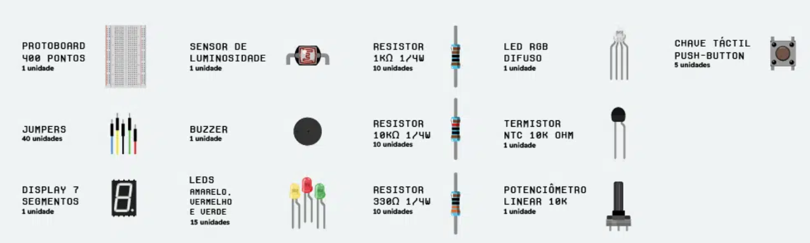

# 🧠 Projetos com Raspberry Pi

Bem-vindo(a)! 👋  
Este repositório reúne alguns projetinhos que estou desenvolvendo com o **Raspberry Pi** — uma plaquinha superversátil usada para aprender eletrônica, programação e automação.  

A ideia é mostrar, de forma simples e prática, como usar o Raspberry Pi em diferentes aplicações, mesmo que você **nunca tenha mexido com isso antes**.  
Cada projeto tem explicações passo a passo, código-fonte, esquemas de ligação e o que aprendi no processo. 🚀 

**OBS:** Neste projeto estarei usando o **_Raspberry Pi Pico 2 W_**

---
## 💼 Kit

## ⚙️ Como configurar o Raspberry Pi Pico 2 W
### O Aplicativo
- **Passo 1**: Baixe o aplicativo [THONNY](https://thonny.org/)
- **Passo 2**: Em seguida, clique em Avançar e Instalar para finalizar a instalação do Thonny.

### O Raspberry

- **Passo 1**: Pressione e segure o botão BOOTSEL e utilizando o cabo USB, conecte a Pico W à porta USB do computador. Solte o botão BOOTSEL só depois que sua Pico W estiver conectada ao computador.

- **Passo 2**: Ela será identificada pelo computador como um dispositivo de armazenamento em massa chamado RPI-RP2.

- **Passo 3**: Abra a a IDE Thonny e na parte inferior direita clique no menu de interpretadores, que provavelmente estará com os dizeres “Local Python 3 . Thonny’s Python” se você instalou em inglês ou “Python 3 local . Python do Thonny” se você instalou em português.

- **Passo 4**: Clique em Instalar Micropython, em Target volume ele deve já indicar o RPI-RP2. Caso não indique, selecione na lista. Micropython family já deve estar como RP2, então não é necessário selecionar a menos que não apareça dessa forma. Em Variant selecione o modelo de placa Pico que você está utilizando. A versão será populada automaticamente com a última versão disponível.

- **Passo 5**: Clique em Instalar e aguarde a conclusão, o Thonny irá baixar e instalar o Micropython na sua placa. Quando finalizar, feche a janela de instalação.

- _**Pronto! Agora você está executando o MicroPython.**_
---

## 📂 Índice de Projetos
- [Hello World](./projects/hello-world)
- [Led Embarcado](./projects/led-embarcado/)
- [Pisca Pisca](./projects/pisca-pisca/)
- [SOS](./projects/SOS-luminoso/)
- [Brilho Ocilante](./projects/brilho-ocilante/)
- [Luzes Coloridas](./projects/Luzes-coloridas/)
- [Troque a cor das luzes](./projects/troque-a-cor-das-luzes/)
- [Interruptor de luz intermitente](./projects/interruptor-de-luz-intermitente/)
- [Interruptor de luz liga-desliga](./projects/interruptor-de-luz-liga-desliga/)
- [Sensor de luz ambiente](./projects/sensor-de-luz-ambiente/)
- [Adicionando um buzzer](./projects/adicionando-buzzer/)
- [Dó Ré Mi](./projects/do-re-mi/)
- [Contador Digital](./projects/contador-digital/)
- [Dado eletrônico](./projects/dado-eletronico/)
- [NTC](./projects/ntc/)
---

## 🧭 Sobre este repositório
Este espaço é um **diário de aprendizado** — vou documentando cada projeto, mostrando o que fui descobrindo ao longo do caminho.  
A ideia é ajudar quem também está começando e quer aprender de forma prática. ❤️  

Se quiser acompanhar as atualizações ou contribuir com ideias, fique à vontade!  

📬 **Contato:** [@SarahSantana](https://www.linkedin.com/in/sarah-santana-843394200/)

---

> _“O melhor jeito de aprender é colocar a mão na massa.”_ 💪
