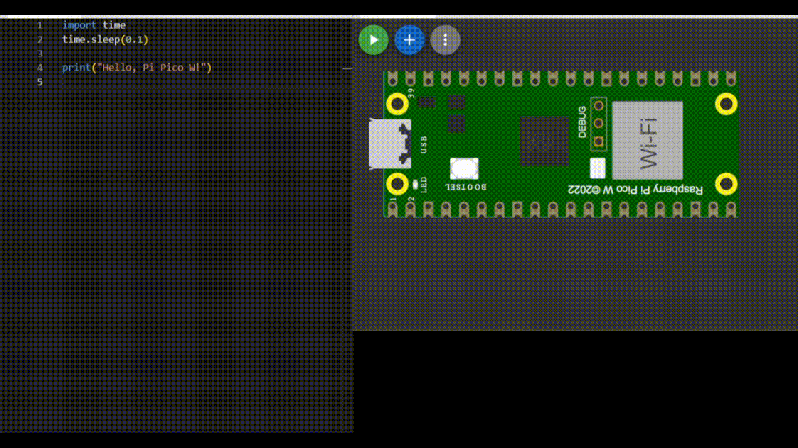

## 👋🏽 Hello World 
**Objetivo:** Conhecer como funciona. 
**Nível:** Iniciante  
**O que você vai precisar:**
- Raspberry pi pico 2w
- Cabo Micro-USB (já vem o cabo por padrão)

📘 *Explicação passo a passo e código:*
- Primeiro você conecta o cabo USB no computador, enquanto a outra ponta (Micro-USB) você conecta na plaquinha.
- Logo em seguida você abre o aplicativo Thonny.
- Faça o seguinte código abaixo:
- [Código aqui](/hello-world/cod/helloworld.py)

- Logo após salve no Raspberry PI (em um novo arquivo ou na main) com o final .py (ex: helloworld.py)
- Rode o código e pronto. **Parabéns você criou seu primeiro código!**