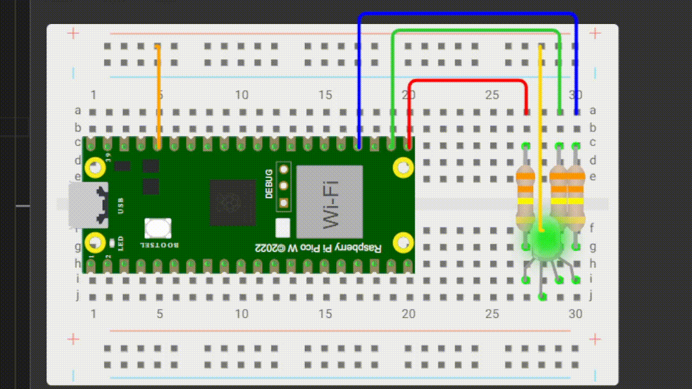

## Luzes coloridas
**Objetivo:** Fazer com que o led fique colorido 

**Nível:** Iniciante  

**O que você vai precisar:**
- 1x LED RGB 5mm
- 3x Resistor 330 ohm
- 5x Jumper Macho-macho
- 1x Protoboard 400 pontos
- 1x Cabo USB
- 1x Placa Raspberry Pi Pico

📘 *Explicação passo a passo e código:*
- Primeiro você conecta o cabo USB no computador, enquanto a outra ponta (Micro-USB) você conecta na plaquinha.
- Faça essa **[conexão](/assets/image.png)**
- Logo em seguida você abre o aplicativo Thonny.
- Faça o **[seguinte código](/src/luzes.coloridas.py)**

### Resultado final:

