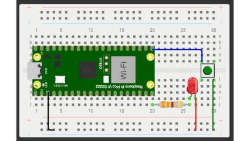

## Interruptor de luz liga e desliga
**Objetivo:** Fazer o led ligar apenas se apertar o botão

**Nível:** Iniciante  

**O que você vai precisar:**
- 1x LED Amarelo 5mm
- 1x Resistor 330 ohm
- 1x Chave Táctil Push-button
- 1x Protoboard 400 pontos
- 6x Jumper Macho-macho
- 1x Cabo USB
- 1x Placa Raspberry Pi Pico

📘 *Explicação passo a passo e código:*
- Primeiro você conecta o cabo USB no computador, enquanto a outra ponta (Micro-USB) você conecta na plaquinha.
- Faça essa **[conexão](./assets/interruptor.png)**
- Logo em seguida você abre o aplicativo Thonny.
- Faça o **[seguinte código](./src/interruptor-liga-desliga.py)**
### Resultado final:
