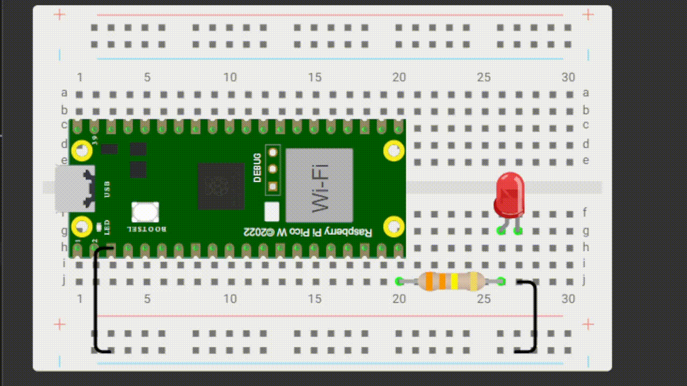

## Pisca-Pisca 
**Objetivo:** Piscar o led

**Nível:** Iniciante  

**O que você vai precisar:**
- 1x LED Vermelho 5 mm
- 1x Resistor 330 ohm
- 1x Protoboard 400 pontos
- 2x Jumper macho-macho
- 1x Cabo USB
- 1x Placa Raspberry Pi Pico

📘 *Explicação passo a passo e código:*
- Primeiro você conecta o cabo USB no computador, enquanto a outra ponta (Micro-USB) você conecta na plaquinha.
- Logo em seguida você abre o aplicativo Thonny.
- Faça essa **[conexão](./assets/conexao-pisca-pisca.png)**
- Logo em seguida você abre o aplicativo Thonny.
- Faça o **[seguinte código](./src/pisca-pisca.py)**
- Logo após salve no Raspberry PI (em um novo arquivo ou na main) com o final .py (ex: helloworld.py)

