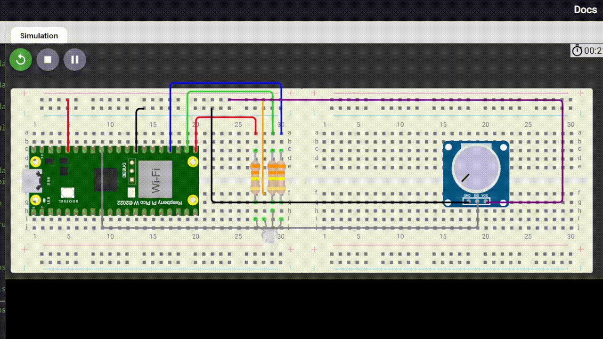

## Troque a cor das luzes com potenciômetro
**Objetivo:** Trocar a cor das luzes

**Nível:** Iniciante  

**O que você vai precisar:**
- 1x LED RGB 5mm
- 1x Potenciômetro 10K ohm
- 3x Resistor 330 ohm
- 1x Protoboard 400 pontos
- 9x Jumper Macho-macho
- 1x Cabo USB
- 1x Placa Raspberry Pi Pico

📘 *Explicação passo a passo e código:*
- Primeiro você conecta o cabo USB no computador, enquanto a outra ponta (Micro-USB) você conecta na plaquinha.
- Faça essa **[conexão](./assets/trocando-luz.png)**
- Logo em seguida você abre o aplicativo Thonny.
- Faça o **[seguinte código](./src/trocar-cor.py)**
### Resultado final:
